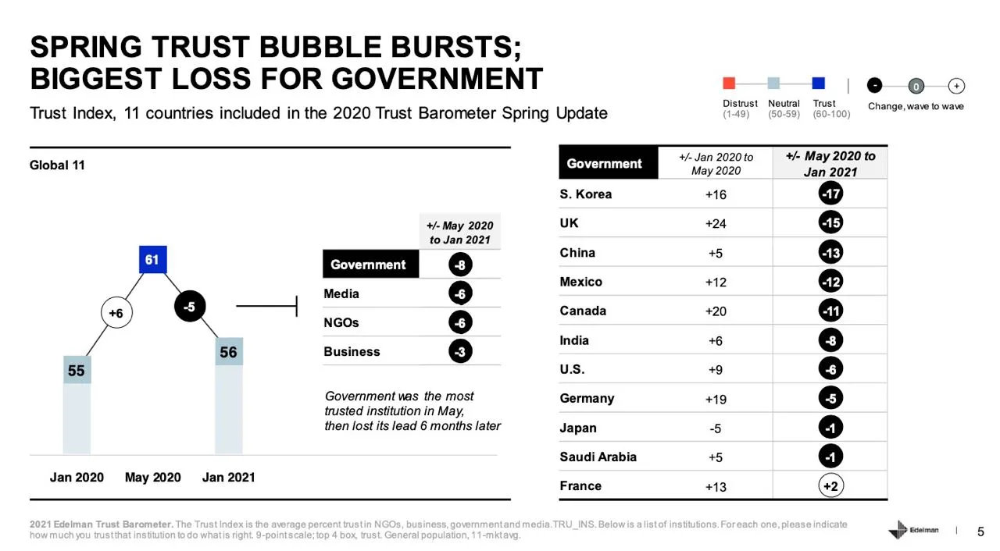
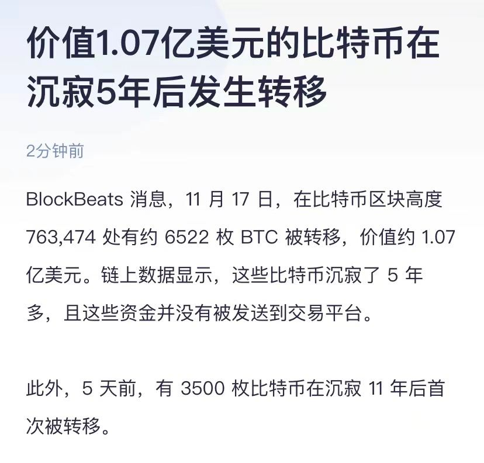

# The Network State 网络国家梗概

<aside>
✏️ by Boyang @b0yan913

> There's also a [English vs Chinese side-by-side version](https://www.thenetworkstate-zh.com/Foreword-EnglishvsChinese-theNetworkStateChineseVer.pdf) for anyone who might be interested
</aside>

# 1. 即刻启程

本文是对 [https://thenetworkstate.com/](https://thenetworkstate.com/) 网络国家一书的概括性导读. 本文不是严格的翻译, 没有囊括作者Balaji Srinivasan原书所有论点, 而是在一些主题下添加了对**编者**和**本文读者**更有意义的例证和论述. **那即是, 在大中华区语境下, 大陆内外的华人, 我们此刻正面对的形势和惊涛骇浪的未来**. 所以, 这是一篇注疏.

### 网络国家一书可以拆分为以下两部分内容

- 网络国家的构想能够成立, 并且此时可以开始孕育生长的
    - 理论基础
    - 历史发展, 国际局势和社会现状
- 网络国家的建立和实操的
    - 大方向路线图
    - 作者对具体执行路径的认识

### 网络国家的基本论断

- 我们当然希望能建立新国家! 就像一个创业公司, 就像一片处女地, 有了新的空白的东西, 就能做实验 (实验国体, 实验政策), 可以竞争, 可以发展. 否则, 无穷的旧建制, 旧官僚, 会阻挡任何创新, 在国家邮电部里做不出来腾讯. 有志青年创办公司, 和创办党派建立国家是一脉相承的
- 网络国家长什么样? 简短地, 从结论上来说:
    - 网络国家有一个网络社群 + **并且有坚定的信条**. 围绕这个信条聚集了一群人. 这里网络国家的信条, 和宗教中的教义, 民族国家的宪法, 扮演类似的角色. 这个信条往往是一个**政策创新**
    - 网络国家有自己的crypto以及一系列激励和治理机制, 能自己发币自己控制自己的财政. 核心参与者有信念上和利益上的双重动机来做贡献. 网络国家也通过种种方式 (收税, 党费, 业务盈利等) 方式建立了自己的国家金库
    - 网络国家用自己的组织和财力, 与实体存在的各家地方政府协商, 买入小块的土地, 且是有治外法权的土地. 这对于穷国, 小国来说并不是不可想象的! 想象在中北美加勒比, 或者中南半岛上, 求购长租一个地块, 每年上交几百万美元税费给地方政府, 来进行Peter Thiel梦寐以求的生物医药实验. 此时, 网络国家从纯线上组织, 变成了拥有一块块的土地和飞地的网络群岛
    - 最后, 网络国家
        - 1. 通过链上的财力证明
        - 2. 通过国民成员加密签名的人口证明
        - 3. 通过一系列有实质进展的动作 (包括不限于, 网络国家中孕育出商业公司和技术项目, 创作出不限于文章电影漫画的NFT文艺作品和文化名人, 用金库采购资产, 布道者宣传推广自有社媒账号累积影响力, 等等)
        - 使得影响力, 资源, 力量越来越强大. 最终, 从一些小国家开始, 他们逐渐看到与网络国家建交的正当性和收益. 一个一个国家地, 网络国家会逐步获得外交承认, 获得国家享有的基本权利. 例如能够签发护照, 能够享受外交礼遇, 能够列席国际组织和会议
- 上面是直接抛出的结论, 后续章节有更多论述. 这里涉及到的值得注意的论点包括
    - 比特币诞生之初, 没人觉得有主权国家会承认. 现在在萨尔瓦多和中非共和国, 比特币已经是法定货币, 商家必须接受了. 而在地球任何其他的角落, 你给别人比特币, 都没有人不想要的道理 - 只不过是溢价或者折价的问题而已
    - 萨尔瓦多和中非共和国, 你可能会说这是不值一哂的小国, 破国. 但是抛开中国人民和美国人民的大国沙文主义, **大多数国家都是小国**. [联合国承认的 193 个主权国家](https://www.un.org/en/about-us/growth-in-un-membership)
    中, 20% 的人口不到 100 万, 55% 的人口不到 1000 万. 例, 塞浦路斯 (120 万), 爱沙尼亚 (130 万), 新西兰 (470 万), 卡塔尔 280万, 蒙古 340万, 挪威 540万. 我们建国:
        - 先做出个800人的梵蒂冈
        - 再做出1.1万人的瑙鲁
        - 再做出3.8万人的摩纳哥
        - 再做出36万人的冰岛
        - 创业十年, 做出150万人的巴林
    - 要看到, 这些都是有外交承认的国家, 都能印护照, 都能立法管辖. 这当然不容易! 建立一万人的网络国家, 难度不亚于成功建立独角兽创业公司. 但是我们这一代都看到了Google, Facebook, Alibaba, Tencent如何拔地而起, 成为几亿几十亿用户, 几万几十万员工, 千亿万亿市值的庞然大物. 下一个二十年, 会有一代最杰出的创业者去建立网络国家, 其中最佼佼者们会推动国家形态走向下一个篇章, 建立最大最有影响力的网络国家

# 2. 历史的轨迹

<aside>
✏️ 除非经由记忆之路, 人不能抵达纵深
- [德] 汉娜 阿伦特 1961

</aside>

这一章, 以历史的轨迹为名, 篇幅也是全书最长的. 讲建国, 为什么历史这么重要? 如果是技术创业, 历史课似乎就没那么重要.

这里说的历史, 不仅是历史, 还包括信息, 新闻, 解释权, 内容审查. 这一章实际是全书的理论基础, 逻辑路径是:

1. **历史极其重要, 特别是对建国这件事情**. 其实做任何事情都依赖广义的**历史**, 也就是所有人类经验的结晶. 造火箭, 要先学牛顿力学. 做技术, 要先学计算机组成. 不同的是, 客观科学规律, 通常是可证伪的, 并且通常国家政府没有动机去混淆和篡改结果. 给一个国家的学生传授错误的牛顿定律公式, 对国家几乎没有任何好处. 但是社会科学的历史完全不是如此. 它难以做严谨的实验, 难以重复实验来证伪, 并且国家有充分的动机和能力来篡改历史. 我们每个人, 在不管成长在哪一国的信息体系中, 接受到的历史信息几乎都是扭曲的, 这也使得人类在建国这门学问上建树寥寥
2. **历史如此重要, 但是历史被国家牢牢控制和随意修改, 使得建国困难重重**. 信息, 新闻, 解释权, 内容审查, 这些都不是硬科技. 你做出了可回收火箭, 几乎都会认. 你登月了, 大部分人会认. 但是你的政策好不好? 人民是否拥护政府? 可以随便报道, 随便讲. 从这个角度说, 操纵人类不难. 控制了一个人的所有信息入口, 就控制了这个人. 这样的信息控制, 一定程度上在这个时代可以说变得更简单了, 因为大家都被聚集到了巨大的互联网内容平台上. 90%的人看的90%的内容都已经帮忙归集到这些平台上了, 任人宰割. 此时的我们, 就像没有蒸汽机和内燃机的资产阶级一样, 跃跃欲试, 但是只能徘徊在工业革命初级水平
3. **去中心化账本 - 区块链技术的核心实质, 是透明地不可篡改地记录信息.** 这样的实质天然动摇了主权国家旧有的根基. 现在有了国家不能查封的资产, 国家不能删除的新闻, 国家不能破译的消息. 国家作为这个时代最强的利维坦 (Leviathan) 的地位被动摇了. 基于此, 我们真正地在正面回答 Why now? 和 Why Web3? 这两个问题. 我们回答了为何在今时今日可以严肃地讨论建立网络国家这一命题. 我们也回答了建国这一业务, 和Web3这一技术的本质连结

一些重要的论点:

- 控制了信息 / 新闻 / 解释权 / 内容审查, 就控制了一切意识形态. 除了硬科技生产力的东西做不了之外, 其他颠倒黑白都可以做. 我们现在看到的社会很多问题, 第一是很多本身就源于建制 (现有的主权国家力量) 自我保护自己落后的部分才产生的, 第二是靠传统的内部的力量几乎无法抗衡了. 传播的信息只是国家希望透出的信息, 不存在 “慢慢会变好” “慢慢会解决”. 往往只能在脱离一个国家的物理边界之后, 才能开始接触到控制之外的信息, 慢慢觉醒. 而这样的人永远是少数, 影响力多数情况下也有限
    - 信息控制的力量和重要性需要很多例子来踩实, 原书中提到很多. 例如**什么决定某项医药研究得不到拨款? 什么决定立法惩罚某种行为? 什么决定当国家调遣国民, 例如上战场或者内控抓人的时候, 个体是真的听从执行还是哗变?** 这些现在都被国家通过信息和经济手段, 牢牢掌控着
    - 区块链能改变信息和经济被控制的态势
- Distributed Ledger, 分布式账本, 区块链技术的本质就是透明可查的, 不可篡改的信息记录能力. 这样的能力能用来做什么? 中本聪向我们展示了第一个killer app, 可以用来记录转账, 这样你的就是你的, 不能篡改, 不能冻结, 不能撤回. 这听起来是限制, 但是在生产关系的斗争当中实际是一种保证, 是前所未有的创举. 是一种新的超能力. 仅靠这一核心点, 就撑起了比特币成为了几千亿美元体量的资产
- 过往, 在这样多的歪曲, 斗争, 涂抹之下, 我们对历史和社会科学很多研究和实验是缺位的. 如果一个实验得出来的结果不符合这一个或下一个政府的利益, 实验结果也会被抹杀. 我们整个文明在这个领域的进展太落后了
- 区块链能记录交易, 并且基于Layer2, MerkleTree, ZKP等技术还能储存和验证多得多的数据. 我们可以把大量信息放到链上. 上链的信息不一定是 “真实”, 但是由于有私钥和密码学保证, 一定能说明是特定时间特定人物发出的特定信息. 这已经足以写下很多不可篡改的历史了
- 在这之前一步, 智能手机, 摄像头, 互联网, 社交媒体的普及使得人人能录像, 人人能存储, 人人能发表 (这点上有反动复辟). 为记录客观历史又增加了无数去中心化的, 普及到大众的力量. 这在近期的一系列群体事件中体现得淋漓尽致
- 认为 “建国不可能, 建国做不到, 建国**违法**”, 这些都是未经理性思考的惯性感受. 实际上, 不仅事实永远被涂抹篡改, 法条也是**朝生夕死, 左右摇摆**的. 08年奥运会的时候是戴口罩就辱华, 几年后雾霾大家都接受了戴口罩, 再过几年疫情是不戴口罩就抓走. 固然, 客观条件变化了, 但是从中已经足够我们看到所有法条, 公序良俗, 任何貌似不容辩驳的规则之上**露骨的显然的**的相对性, 时代性, 可变性. 注册私人公司有时候合法, 违法就说投机倒把. 多偶有时候合法, 违法就说是重婚罪. 同性性行为有时候合法, 违法就说是Section 377A. 基因编辑疗法有时候合法, 违法就说非法行医. The list goes on and on:
    - 蓄奴合法吗? 不知道, 要看哪个年头
    - 十四岁未成年人婚姻合法吗? 不知道, 要看哪个地方
    - 裸盖菇素合法吗? 娱乐大麻合法吗? 酒精合法吗? 烟草合法吗? 基因编辑合法吗? 基因疗法合法吗? 干细胞疗法合法吗? 干细胞养生保健合法吗? 换血养生合法吗? 换器官合法吗, 什么情况下合法?
    - **所以, 建国合法吗?** 尚不清晰. 但我们将思考, 实践, 追寻真理, 推动文明进步. 这一些都不因愚人的俗见而动摇. 坚守科学理性, 没有什么是神圣不可研究的, 也没有什么是至高无上不可打破的. 学者科研实验, 企业家创业经商, 革命者举旗建国, 本无二致, 一体同观.

我们再来看一些离我们这些创业者很近, 耳熟能详的例子吧! 作为一个业余互联网史研究者, it's darn close to my heart:

- 滴滴作为黑车业务, 常年与监管 / 与出租车公司较量, 代司机交罚金, 上市之后还遇到这么大的波折. 但是你去问那位创始人, 他一定不后悔创办滴滴.

- 快递作为明文禁止民营企业涉足的行业 (实际是设置了极大的阻碍门槛, 使得所有民营企业经营者必须普遍违法才能运转业务), 四通一达常年与邮政和工商城管打游击, 吃罚单, 朝不保夕. 但你去问那位创始人, 他一定不后悔创办顺丰.

> 　　**【财新网】（记者 徐明）**国家邮政局正加紧对快递行业进行整治管理，近期已取缔了17家未经许可经营快递业务企业，未来将加紧制定快递企业分等分级管理办法，对擅自停收或停投企业依法查处。
> 　　根据国家邮政局3月4日公告，这17家企业集中在内蒙古（6家）、山西（4家）、湖南（3家）、宁夏（2家）、河南（1家）、江西（1家）五个省份。其中，圆通、中通、申通、韵达和宅急送等知名快递公司的部分地方公司赫然在列。
> 　　根据现行《中华人民共和国邮政法》，“经营快递业务，应当依照本法规定取得快递业务经营许可；未经许可，任何单位和个人不得经营快递业务。”《邮政法》同时规定，快递企业设立分支机构、合并、分立，未向邮政管理部门备案的，可以处一万元以下的罚款；情节严重的，处一万元以上五万元以下的罚款，并可以责令停业整顿。
> 　　国家邮政局在这一年开始了关于“非法寄递文件”的转向整治互动和长期的专项检查，几乎所有的民营快递企业，都开始了与邮政的“猫捉老鼠”的游戏。
> 　　《无处不在》一书中曾提到一个细节，“2003年是查抄‘黑快递’最严的时候，在东莞，每个村都有邮政的执法人员和当地的保安在村口把关。”
> 　　到这年底，《邮政法（修订草案）》第五稿再给行业内的所有玩家泼了一盆冷水，该草案规定，针对外资企业以及民营快递企业，500克以下的私人快递业务由邮政专营。随后分别在2004年、2006年、2009年，邮政专营的信件标准一度降至150克以下。
> 　　“依据专营制度加强监管就会导致_民营快递_死亡，这是一个故弄玄虚的伪命题，”北京市邮政管理局局长胡仲元在近日一次座谈会上做出上述表态
> 　　　　**民营快递可能面临“一箭封喉”**
> 今年年初，邮政法修改稿第七稿出炉，一直关注此事的上海民营快递从业者了解到经全国人大常委会审议通过的话，300多万快递从业人员有可能一夜之间变成“非法从业人员”，民营快递公司遭遇了前所未有的“生存”问题。2月13日，满心焦虑的东方万邦等三家上海民营快递公司的老总进京向有关部门陈情。
> 
> 　　焦点在于邮政法第七稿的第十条。今年1月10日，上海一些民营快递企业从非官方渠道看到“邮政法2006.1.5修改稿”(即第七稿)，并且得知已经列入4月全国人大常委会审议和立法计划，其中第十条明确规定，“信件的寄递业务由邮政企业专营，但是国际信件的速递业务和单件重量在350克以上的国内信件除外。”
> 
> 一般老百姓邮寄的平信重量大约在20克左右，350克的重量相当于A4打印纸70余页再加上一个EMS的信封。“民营快递公司的业务90%都是在350克以内，这个规定意味着今后民营快递公司的业务都是非法的。如果第七稿得到通过，那民营快递只能制作一个350克左右的专用快递盒才能避免成为非法经营。最终的结果是资费上调，不公平的成本转嫁到了商业用户身上。”上海东方万邦快递有限公司副总经理刘和平为此愤愤不平。

- 支付宝 / 余额宝离非法集资差得也不多, 上市功亏一篑之后陷入长久的停滞, 难以兑现对团队, 对股东的承诺. 但你还能想象出门带一打纸币, 找钱换来一堆零的散的钢镚的日子吗?

- 6102号行政命令, 禁止拥有黄金. 宪法第18号修正案, 禁止制造 / 售卖 / 运输酒精含量超过0.5%以上的饮料. 基督教禁止离婚, 禁止婚前性行为, 当然禁止同性恋.

- 高考恢复了两次. 其中1973年, 努力备考的人都白考了. 包产到户有三波浪潮, 前两次都是被打为资本主义路线, 右倾, 杀头, 这就是为什么小岗村要签生死契约按手印. 结果只有到第三次被立为典型, 成为改革开放的先声. 如果人人犬儒, "之前有人搞, 结果就是死", 那么改变就永远不会到来. **还好, 并非人人犬儒. 我们高级猴子文明充满生命能量. 想吃饭, 想做爱, 想赚钱, 想违法. 想编辑基因, 想改造肉体, 想长生不老, 想去火星. 拦也是拦不住的.**

- 今天的建国, 明天就是史家口中的 "饮酒" "离婚" "婚前性行为" "包产到户" "个体户私营企业" "网约车" "民营快递" "移动支付" 而已. 此时此刻, 正如彼时彼刻.

### 政权与科技的较量

科技的进步, 在我们已知的范围中, 基本是持续向上的. 我们希望它能保持这样的趋势, 加速发展, 给人类带来更强大美好的未来. 但是政治与社会科学, 很大程度是周期循环的. 叠加在一起, 我们看到一个螺旋上升的图形, 我们也看到天性追求进步的科技, 与天性追求统治 / 稳定 / 保守 / 民粹的政治之间的尖锐对抗.

举例来说, 曾经的宗教, 现在的主权国家, 用这样一些方式控制信息 (可以把这些方法当做增长策略, 当成投放技巧和产品套路来看待):

- 万金油谋杀模式: 任何事情如果政权想禁止它, 就找出一个个例是因为这件事而死人的, 并大肆宣传. 这个事就可以被阻止了 (开发新药, 自动驾驶, 等等). 这里的逻辑当然是荒谬的, 开车一定会死人, 游泳一定会死人, 没见到禁止开车和游泳的. 这个模式已经严重让政权搬起石头砸自己的脚了. 很多本来政权想要推动的事情, 也因为能找出一个死人, 而民情汹涌, 推动不了. 这样, 社会啥都推动不了, 什么积极变化也不会有, 约等于统治者就达到目的了 - 什么都不变, 即我继续统治. 坏处是落后于世界, 无法跟上新潮流. 但是如果外界世界都在衰退, 或者没什么新潮流, 这样就有益无害
- 受害者模式: 选一个主流人群, 找出尽可能多的 (很容易找) 这个人群被损害被侵犯的例子大肆宣传. 后续当需要攻击任何敌人的时候, 只需要指向这个敌人也惹过这个人群的例子, 就能勾起所有宣传教育打下的情绪基础, 让人一下联想起历史上所有的暴行惨案艰难困苦忍耐委屈, 指哪打哪无往不利. 例, 侵华辱华, 女性女权
    - 再例, CoD有几代游戏, 因为中国是反派, 在中国市场发售不了. 再例如其他一些游戏里设定未来中国分裂了 (FMP), 在中国市场也过不去. 新鲜了, 俄罗斯天天在游戏里做反派, 美国也天天是游戏里的邪恶大boss, 没见这些游戏不能在这些国家上架赚钱
    - 基于长久的宣传, 听到一丝中国不好, 就联想到南京大屠杀, 就联想到八国联军, 就联想到九一八事变, 乃至联想到扬州三日嘉定三屠 (?), 情绪上来了, 事情就利于上纲上线了
    - 编者比较熟悉游戏, 读者可以想想自己喜欢的文艺领域里是否也是如此. 并且是不是民众G点的敏感与否, 是可以靠长期宣传来引导 / 脱敏的. 再考虑一下中美, 中日, 中韩关系, 在不同的阶段是什么样的舆论风向

政治大多数时候都是主观的, 是目的导向而非真理导向的. 沉溺于政治中往往是从一个谎言走向另一个谎言, 右派也在骗左派也在骗, 朝代更迭就在这样的虚无中重复. 作为科技创业者, 我们如何把握到有意义的真实?

谜底就在谜面之中 - **我们把握科技**.

正如本章开头总结到的. 政权也希望农业兴盛, 工业发达, 不长庄稼统治者也受不了. 政权允许科技发展, 科技终于发展到了一个转折点, 发展出了不可删除篡改的信息记录和不可查封罚没的资产. 科技有了新一代武器, 又有机会在下一个百年占到上风, 让先进生产力来引导生产关系变革的方向!

解决粮食短缺, 是靠勤俭光盘不挑食的美德吗? 靠农业科技. 解决艾滋病, 是靠洁身自好禁欲吗? 靠疫苗. 解决异地相思之苦, 是靠忠贞不渝吗? 靠视频通话. 平安喜乐无病无灾, 是靠虔诚祈祷善有善报吗? 靠体检.

一个人生来残疾, 遗传疾病. 是靠悦纳自我知足常乐, 还是靠与病魔斗争的坚定意志? 靠基因编辑, 人造器官. 一个人残忍嗜杀, 反社会, 想当街扫射. 一个人性癖奇特, 世间难寻. 一个人必须当人上人, 有万千臣民跪倒面前才满足. 这靠法律法规, 正义的公安干警来解决吗? 靠游戏, VR, MR. 现在每天全世界已经有上亿人在FPS游戏中相互爆头, 乐此不疲. 如果还不行, 再靠思想钢印.

让人不再信教, 靠的是现世接近于天堂.

作者在书中列出了一系列政权的历史和科技的真实之间已经在正面交锋的例子, 展示了我们这一节强调的政权与科技的较量的主题. 这些不一定是对你最有说服力最能共情的例子, 但你一定能想到更多:

- 智能手机摄像头的广泛普及, 使得大部分事件都有不少目击者的图片和影像资料. 直播这一方式的各方面基建也非常成熟了. 这一点在近期的一系列封城劫难引起的社会事件中体现得淋漓尽致
    - A plot twist - AI画图和换头技术在威胁这个真实性. 但是我们当前阶段, 一个荒谬的情况是政权反而不是最掌握这些技术的一方. 在可预见的将来, AI能无中生有编造出不存在的视频, 甚至让全人类无法再 “眼见为实”, 但是并没有方式能伪造链上交易, 伪造签名 (除了暴力手段). 于是, 我们仍然能守住区块链授予的 “某人在某时间发出了某信息, 随时透明可见, 无法被篡改” 的底线
- 人人有存储, 硬盘, 手机. 信息被从互联网公开渠道删除之后, 总能直接展示给你看. 端到端加密和P2P传输网络还有可能让这一方式变得更强 (Airdrop, Bluetooth)
- 对于绝大多数国家来说, 封闭互联网, 白名单访问, 是不切实际的. 在中国的语境下却并非如此. 域名解析, IP, 服务器数据中心, 应用商店和分发渠道, 目前都越来越被钳制. 全国局域网并非不可想象, Open Web目前在正在节节败退. 所以最后这个例子不同于前两个, 是科技在与政权较量中落于下风的例子. 原书中, 用 “中国真的能造铅笔✏️” 来讨论了这一点 - 大部分国家都无法脱离国际社会, 闭关锁国, 自给自足. 缺乏了全球供应链, 一根铅笔都造不出来. 但是中国真的可以内循环, 自我闭环

科技提供的真实其实弥足珍贵. 有太多 “事实” 是主观的, 相对的, 难以查验的. 说你行你就行; 人们相信就是真. 事实篡改, 法条随意, 却仍然被强力执行.

现在, 我们有了链上数据, 有了 “新闻合订本”, 有了量化的分析 (几千人买入, 几千人卖出; 平均如何与合约交互, 发交易的统计和概率, 等等. 如果游行的人出门前上链发个交易并抵押0.01BTC, 回家也发个交易并取回BTC, 那么游行多少人和被抓被杀多少人, 都是谁, 就不是莫衷一是的口水仗, 而是能基于客观事实). 我们开始走向真实, 走向有意义的可证伪的实验, 走向实证主义. 而实证主义, 是知识和进步的起点.

### 三个利维坦: 宗教, 政权, 网络

利维坦是世界上最强大的力量. 利维坦存在于人心. 不是僧侣能听到每一句渎神的低语, 而是教徒想象中的神可以让他下火狱, 永劫无间; 不是秘密警察能逮捕每个躲到乡村的政治犯, 而是民众想象中的政权可以抓走他全家, 影响三代政审. 关于利维坦的上下文:

> 《利维坦》全书分为四部分，分别为“论人”、“论国家”、“论基督教国家”、“论黑暗王国”。该书写于[英国内战](https://zh.wikipedia.org/wiki/%E8%8B%B1%E5%9C%8B%E5%85%A7%E6%88%B0)进行之时。在这书中霍布斯陈述他对社会基础与政府合法性的看法。在人类的自然状态下，有一些人可能比别人更强壮或更聪明，但没有一个会强壮到或聪明到不怕在暴力下死亡。当受到死亡威胁时，在自然状态下的人必然会尽一切所能来保护他自己。霍布斯认为保护自己免于暴力死亡就是人类最高的必要，而权力就是来自于必要。
> 
> 
> 在自然状态下，每个人都需要世界上的每样东西，也有拿取每样东西的权力。但世界上的东西都是不足的，所以就有持续的，基于权力的“[所有人对所有人的战争](https://zh.wikipedia.org/wiki/%E6%89%80%E6%9C%89%E4%BA%BA%E5%B0%8D%E6%89%80%E6%9C%89%E4%BA%BA%E7%9A%84%E6%88%B0%E7%88%AD)”。人生在自然状态下是“孤独、贫穷、龌龊、粗暴又短命”（xiii）。
> 
> 自然状态下的战争并非对人最有利的状态。霍布斯认为人因为自利和对物质的欲求，会想要结束战争——“使人倾向于和平的热忱其实是怕死，以及对于舒适生活之必要东西的欲求和殷勤获取这些东西的盼望”（xiii, 14)。
> 
> 霍布斯认为社会要和平就必需要有[社会契约](https://zh.wikipedia.org/wiki/%E7%A4%BE%E6%9C%83%E5%A5%91%E7%B4%84)。社会是一群人在一个威权之下，而每个人都将所有的自然权力交付给这威权，让它来维持内部和平和进行外部防御，只保留自己免于一死的权力。这个主权，无论是[君主制](https://zh.wikipedia.org/wiki/%E5%90%9B%E4%B8%BB%E5%88%B6)、[贵族制](https://zh.wikipedia.org/wiki/%E8%B2%B4%E6%97%8F%E5%88%B6)或[民主制](https://zh.wikipedia.org/wiki/%E6%B0%91%E4%B8%BB%E5%88%B6)（霍布斯较中意君主制），都必须是一个“利维坦”，一个绝对的威权。
> 
> 对霍布斯而言，法律就是要确保契约的执行。利维坦国家在防止人对人的攻击以及保持国家的统合方面是有无限威权的。至于其他方面，国家是完全不管的。只要一个人不去伤害别人，国家主权是不会去干涉他的。（不过，在国家主权之上并没有任何更高的权力可以防止国家破坏这规则。）国家主权也要保持内部的平等。
> 

坚定的国民的爱国, 和坚定的教徒的信神是一脉相承的. 从这个角度说, 无神论这一词并不准确. 宗教 (统治虔诚的信徒) 是一个利维坦, 政权 (统治爱国的民众) 是一个利维坦. 从宗教到政权, 是一次利维坦的搏斗和改朝换代.

科技创造的网络是冉冉升起的第三个利维坦.

宣扬网络国家, 我们的目的不是指摘美帝国主义, 或是批判三共王朝. 这些是执行细节, 是战术和战役, 不是战争. 我们的目的是推动人类文明形态进入下一个阶段.

我们毫不吝啬赞美之词. 民族国家曾是先进的进步的力量, 威斯伐利亚国家曾是打破神权垄断的决定一击. 她也带来了生产力的大发展, 带来了民族国家之间的竞争与合作. 伊比利亚半岛与地理大发现, 兰开夏郡与工业革命, 巴黎与大革命, 休斯顿与六次登月, 深圳与改革开放. 我们至今沐浴于她的恩泽当中.

后来, 就像任何生产关系一样 - 她一开始是先进的, 促进生产力的发展, 然后生产力脱胎其中成长到了下一个阶段, 她变成了落后反动的生产关系. 她即将逐步, 螺旋式地完成她的历史使命, 退出历史舞台.

这将是一场持久战. 但是为什么可以现在开始? 这里我们重复之前章节的核心论点:

> 区块链是国家不能查封的资产, 国家不能删除的新闻, 国家不能破译的消息.
> 

这其中Web3是致命武器, 是珍妮纺纱机, 是内燃机, 是火器. 让庶民和骑士站在了同一个战场上, 深刻改变了社会形态. 但是在Web3之外, 比Web3更大的历史当中, 国家政权的退场同样是主旋律, 主舞台. 没有Web3, 这一切也将以浩荡之势缓慢发生.

这一节的主要论点还包括:

- 就像神权惩罚渎神行为其实成本高昂, 难以普遍执法一样, 国家也难以普遍执法 (当然, 已经精细得多). 神权依赖的还是下地狱的预期. 国家依赖的是法网恢恢, 疏而不漏, 政权会一直存在, 一直这么强大, 总有一天抓到你数罪并罚连累三代政审的预期
- 国家这么厉害, 中本聪到今天还是匿名. 不要说找到中本聪对国家没有足够大的利益, 朝鲜训练有素的黑客团队肯定不这么认为
- 网络国家不是无政府主义, 这些在[后续一章](https://www.notion.so/The-Network-State-8b74d1a9c3784d10b80e14f6e6a8b06e)会详细阐述. 网络国家是多个产品, 是市场竞争, 是准入和退出的权力
- 智能合约规定的法律精确, 可以迭代, 执行无误差. 网络国家国民面对链上执行的结果, 包括有争议的结果 (例如闪电贷攻击), 最终会像教徒对神启一样虔诚接受. 网络最终变成最不容置疑和最公正的力量
- VR和AR的发展显然也在推动这一趋势. 拿破仑要回到忠诚的巴黎才能继续施政, CZ可以躲在世界上某个安全的角落做业务
- 国家政权是不是已经在被肢解, 被分离? 当然是了! Twitter是宣传部, Uber是交通部, 四通一达是物流, AWS和阿里云是发电厂/自来水厂. 大型技术公司做的都是本来国家政权做的事的一部分. 这些被肢解, 被 (政权自愿地) 外包, 被替代, 当然也在来回拉锯的过程中
- 将Google / AI / GPT-9 / DALL·E 10 / 健康码尊为天地神祇, 向祂祈祷的思想也在发展
- 原书作者用很大篇幅讲解美国的社会, 左派右派细分, 各路人马真实的政治光谱, 以及在新形态新选择到来之时他们可能的选择 (例, “Woke as a religion”; Right nationalists; Right international capitalists). 上下文: Woke可以理解为白左总称, 包括LGBT, BLM, 我们都欠印第安人, 接纳难民, 环保吃素等一系列思潮
- 做政治, 宗教, 或是做互联网业务, 创业者都意识到了一点, 那就是改变人的思想是极其困难基本不可能的. 改变人的思想 (改变宗教信仰, 改变政治光谱, 改变产品使用习惯) 要靠:
    - 换人群. 例如投放另一个人群 / 市场; 例如战争杀死大部分老人, 新移民迁入, 或者几十年的时间使得旧人群老死, 例如很多经济和政治轮回是大约75年一轮, 也就是一个人的一生
    - 巨大事件. 例如上海封城让不愿意跑出来的人终于出来 (当然, 大部分还会回去), 例如越战对于美国社会
    - 人群压倒性大比例. 例如电商, 网约车, 智能手机. 所以补贴烧钱一定程度上是合理的
- 认为今年就能成功, 这次就要革命, 是左倾盲动错误. 然而认为一切天经地义, 不会改变, 是同样错误的犬儒思想 (base-rater fallacy). 而且这是一种短期主义. 长期来看, 历史变革和技术发展毫无疑问在一个加速的态势中, 进步主义的赢面在增加. 世界是会改变的
- 思想和信息的控制是金融经济控制之后的核心内容 (对应国家不能查封的资产, 国家不能删除的新闻, 国家不能破译的消息). 所以文化 / IP / 文艺作品是这个movement中的重要一部分. 不管是 meme, 黑话, 还是和Web3原生或是高度相关的文艺作品
- 作者用较大篇幅指向了美国建制政权被New York Times / Woke / LA裹挟, 常年渲染, 歪曲, 洗脑人民, 并且后面自己被证伪打脸的种种现象 (资本家坏, 记者好, 殖民坏, 美军拯救世界, 希拉里91%概率赢特朗普). 这个结构在中国有所不同, 但是得出的结论是同样有意义的. 在本文我们不会展开, 但我们每个人都知道在中国的官媒和主旋律叙述中 - 哪怕是主旋律代表先进方向的那些年 - 都没有真相
- 新边疆. 在人类发现了所有大陆, 技术发展停滞, 狂野西部都被圈完之后, 战争就来了. 二十世纪一半热战一半冷战. 反之, 互联网快速发展, 创业机会涌现的时候, 世界就会发展. 网络国家重新开启了边疆
- 本节的其他论点主要从美国政治光谱出发指出左派和右派实际上是当权者和革命者的轮换 (本文作者对此的体感并不直接, 细节请参考原书):
    - 在美国, 左派和Woke太政治正确, 实际已经是掌权者, 所以会有:
        - 在武装直升机上挂Pride旗帜, 宣传美军里女间谍和女兵能顶半边天 (暴力机关和秘密组织本来是右派的心头爱)
        - 通过各种战争预算 (当然口径是为了保护人权而不是扩张美国影响力, 符合左派叙事)
        - 觉得Twitter封杀特朗普账号挺好, 甚至援引私产可以自由处置这样的右派法条
    - 在美国, 右派企业家成了革命者少数派, 所以会有:
        - 不想打仗, 四处撤军
        - 反对并且信不过FBI
        - 为言论自由奔走, 为的是希望自己阵营还能发声
    - 在中国, 当然, 当年的革命党现在都是太子党和红N代了, 需要有统治阶级维稳的自觉, 革命方法论不能总挂在嘴边了
        - 共产党按理说本来是最左的党, 但现在鼓励扶植民族主义民粹主义, 与原教旨共产主义是背道而驰的. 这也是统治需要
        - 其他例子当然更多. 革命的时候利用工人运动, 执政了之后要镇压游行上访. 革命的时候调动报刊文宣, 执政了之后极致屏蔽内容审查

### 社会信条 / 政策创新

在很长的篇幅分析美国的政治光谱, 历史, 社会力量之后. 我们开始思考我们作为科技创业者, 作为初创社会和网络国家的创建者的执行路径. 初创国家是网络国家的前置形态, 不妨分别对应为startup和unicorn.

新产品要显著创新, 要比旧产品好十倍. 科技创业要在科技上创新, 网络国家要在道德, 法律, 信条上创新. 我们将找到旧道德, 旧法律, 旧宪法, 旧信条中最薄弱和倒行逆施的一环. 转化用户用新产品难, 转化用户靠拢新社会新国家更难. 但是同时, 核心用户爆发出来的忠诚度和参与热情也远超普通的互联网产品.

本书将这样的一个社会信条 / 政策创新称为One Commandment. 后文将同时使用社会信条 / 政策创新两个词来指代.

科技创业要在科技上创新, 科技创业的一份BP要阐述自己的方案更廉价, 更高效, 更先进. 而初创社会和网络国家是政策创新为根本, 要阐述自己的理念为何更公平, 更高效, 更正确, 让所有成员生活更好. 

什么会是一个新的网络国家可以实施的创新? 一些例子

- 在大部分国家, 药监局 / FDA有官僚的漫长的新药上市流程. 这对于一些重病患者来说是生死大事, 是无法承受的生命之重. 如果你的国家能生产其他国家禁止的药品 (基于充分披露后果自负的原则下), 或者你的国家能以更可承受的价格推出其他国家价格难以承受的药品, 对于对应疾病的病人来说是生死攸关的价值
- 延展上一条, 如果你的初创社会 / 网络国家, 基于充分披露后果自负的原则, 能够上市大量目前还有争议的保健品 / 抗衰老药品 / 抗衰老疗法 / 疫苗, 能冻卵 / 冻精子 / 辅助生殖 / 克隆人 / 筛选受精卵 / 编辑基因, , 能执行有风险的手术例如大脑皮层植入芯片或者其他的肢体器官增强, 对于相信机械生化人 (Cyborg) 和超人类主义 (Transhumanism) 的人群来说也十分有价值. 光是安乐死这样极小的一步, 就已经让一些病人不得不移动到特定的能够执行的国家了
- 一个禁止垃圾食品 / 禁止大量添加糖油 / 只卖较为健康食品的社区, 也是有吸引力的. 强制和你自己去选择不买不吃当然有很大区别! 要是认为没区别的话, 所有烈性毒品都不需要禁止了. 糖油烟酒和任何毒品一线之隔而已
- 反之所有毒品都合法, 供drug addict来狂欢当然也是可能有吸引力的政策创新. 虽然不政治正确, 但就如同PornHub是成功的商业公司, Bwin Sands都是成功的商业公司,
- 对于社会制度的进步派来说, 认可同性婚姻, 其他特殊形态婚姻 (近亲, 宠物, 虚拟偶像..), 群婚, 有争议的领养和组成家庭的方式等, 也是有吸引力的政策创新
- 在身心灵这一侧, 一个每天断网12小时, 每天必须做一小时冥想的初创社会也是有吸引力的. 其实就是修道院, 僧侣社会, 一直有人投身
- 注意由于初创社会是自由选择, 可进入和退出, 并且可以同时选择多个, 所以对于成员来说转化成本和心理负担在一开始并不高. 我们也和互联网产品一样, 要算转化率, 算漏斗

初创社会和网络国家的创新, 一个很重要的性质是自由选择, 可退出. 对于初创社会和网络国家, 这些不一定完美不一定最终正确的道德 / 法律 / 信条创新, 成员是可以选择退出的. 对于有些情况, 也许退出时会罚没成员的一些押金. 但是这远远好于把道德 / 法律 / 信条与现行国家国籍制度捆绑, 你在哪个国就必须跟哪个国的法律 (在今天的伊朗就要戴黑纱), 换国籍极其困难. 最荒谬的是, 单个国家的政策也会变, 而个人只能被地理位置绑定, 被出生地绑定 (Jus sanguinis), 看革命党保皇派哪边上台, 哪边上台了又要高唱什么自以为是的道德, 通过什么无稽的法律!

当我们建立起初创社会, 当我们确立并坚持执行我们的社会信条 / 政策创新. 这样的新态势会让人期待后续的发展:

- 初创社会之外的成员会观察这个初创社会是会壮大还是萎缩; 其中的社会实验是否成功; 其中的成员是否过得更好了
- 初创社会之内的成员会持续参与, 审视自己的投入是否值得, 并且希望自己作为早期参与者的身份能获得超额回报. 就像本文之前提到的, 信念上和利益代币上的双重动机想让初创社会变得更好
- 初创社会就是母体社会的一个控制变量的对照组. 甚至, 立场相反的人群可能都赞成建立初创社会模式来做实验. 例如一边完全封城内循环, 一边把自己开放成通商口岸入境不需要隔离 - 现在的现状是两边都动弹不得, 互相嫌弃
- 当某个初创社会的实验取得成功之后 - 不需要每个实验都成功 - 那个政策创新就可以并且也会积极地被采纳入其他初创社会甚至母体社会中. 因为现在有了竞争, 没有人愿意落后, 落后的社会就会失去成员
- 在中国的情况下, 还有两个变量, 一个是信息封锁的强度, 这个成功的对照组实验可能被成功地掐灭或者完全不为外人知晓; 另一个变量是上层的可见性, 如同几十年前必须是邓小平看到了日本, 新加坡和东欧的发展与繁荣, 由上而下推动

另一个相关的话题: 为了享受这样的政策创新, 有可能成员需要加入网络国家, 也就是入籍. 这个过程如何发生? 如何收费, 什么样的商业模式杠杆最高? 

- 首先学习一下现有的一些国家的护照项目. 像前文提到的, 我们不光有格林纳达, 圣基茨, 其实还有希腊, 土耳其, 葡萄牙, 都在用这样那样的方式实质在卖护照. 澳洲加拿大新加坡当然也都有门槛更高的投资移民项目, 高价卖护照. 不少这些项目会选择 “投资XX额度到我们指定的主权基金 / 特定移民项目中, X年后返还, 还有可能有收益哦” 这样的收费模式. 这样的定价策略在心理上会有钱似乎没花掉而是投资了的效应, 同时大多数人也不会计算进损失的利息收益
- 网络国家也可以参考这样的方式, 要想入籍享受 (要知道网络国家入籍是非排外的, 承认多重国籍), 就stake X amount of asset in the form of our native token. 最短stake X年. 之后如果要退籍, 就可以取回自己的资产
- 这样的方式有一个核心杠杆优势, 那就是在链上可以清晰证明人数和资产量. 多少成员, 国库拥有多少资产. 这样的证明都会成为后续网络国家证明正当性的有力证据

在[后续一章](https://www.notion.so/The-Network-State-8b74d1a9c3784d10b80e14f6e6a8b06e), 关于政权正在变为反动, 失去力量逐渐衰弱, 国退网进的理论主题还会重复出现. 但是在上面的一节, 我们已经开始触及网络国家建立的执行层面了! 你很可能会觉得部分论述牵强或不严谨. 但更重要的是, 你是否认为有部分论述是第一性合理并且可执行的?

# 3. 三座支柱时代

在本章中, 作者Balaji认为当今世界最强大的三座支柱力量, 分别是NYT, CCP, BTC

### NYT

New York Times, Woke, 占据道德高地, 是美国的实控人. 代表Homeless, BLM, 我们都欠印第安人, 接纳难民, 环保吃素, 混乱, 高福利, 印钱

### BTC

国际资本主义 International Capitalist, Tech Founders, Crypto Natives, 进步主义, 自由主义, 自己不管好私钥活该

### CCP

中特社, 国家资本主义, Surveillance State, 文艺管制, 内容审查, AI工业化自动化监管, 集中力量办大事, 封闭, 稳定

# 4. 去中心化, 再中心化

### 可能的结局

本节分析其他作者注意到的势力, 以及推演一些世界可能的未来发展. 预言未来最好的方式就是去打造它.

- Chinese Control + CCP: 中国越来越监管封闭, 并且团结带领一帮国家走上1984的道路
- American Anarchy + NYT: 美国越来越冲突混乱, 可能打内战
- Network State + BTC: 代表世界其他80%人民, 包括不在中美的中国人, 美国人的诉求. 在中美之外, 展示一条更好的道路
- 印度: 作者对于物理印度国家的发展谨慎乐观, 但是非常看好海外印度社群整体发展. 这是一个本来就高度适应离散的群体. 一方面, 他们对故国的态度与中国人不同. 印度的构成和建国史也和中国不同. 另一方面, 语言和殖民历史原因, 印度高度融入英语世界. 这是推力和拉力.
    - 本书成文时, Rishi Sunak还没有当选首相
- Peter Thiel为代表的的Tech Capital Progressivist人群
- 显然, 每个人的身份认同 (Identity Stack) 由多个不同的身份组成. 例如复员军人 + 国安球迷 + 昌平土著 + 京B摩托车. 网络国家和初创社会会延续这样的趋势. 和很多国家对国籍有独占性要求, 然后各式各样的方式来隐蔽逃脱的旧模式不同 (几乎所有欺骗, 隐瞒, 灰色地带地下黑市都带来巨大的低效和寻租), 网络国家的国籍会长期不要求独占性, 除了一些特殊的对立例子 (网络国家A与B可能有针锋相对的社会信条, 不能同时入籍). 另一方面, 网络国家的国籍和活动链上可查, 隐蔽逃脱的流弊也会减轻
- 互联网给民众意识形态带来了深远的变化. 她打击了以邻里地理为单位的意识形态, 也打击了民族国家整齐划一的主旋律舆论宣传 (曾经由官方报纸, 电视台和横幅标语大力推动的). 她加剧了信息茧房, 极端人群的对抗, 但也滋养了很多小型的, 隐秘的, 碎片化的社群. 这些社群原本是不可能形成的, 因为他们人数上稀少, 地理上分散, 本来无法互通. 因此互联网也是网络国家能成立更前一步的默认基建
- 本书作者Balaji预言一种完全数字化, 链上化的社会形态. 这一形态是针对解决链上的智能合约和数据有很多无法覆盖的地方的问题. 例如, 现在的链上DAU, 某个链上产品到底有多少活人用户, 是不清晰的. 一方面, 廉价的链可以随意刷量, 地址不能和人口对应. 这个可以用Proof of Humanity等技术解决. 但是另一方面, 99.9%的人类活动当然还没有上链, 以至于无法全部被智能合约读取调用, 无法通过密码学方式来记录和证明. 对于这个问题, 现行的解决方式是预言机. 由区块链这一侧做更多工作, 把链下活动和信息映射过来. 但Balaji对这一问题的长远解决思路是让所有活动尽可能发源于链上, 原生在链上. 而数字化又是上链的前一步
    - 最开始, 信息和活动都在线下, 都没有数字化. 例如手写书信, 口头交流, 发生了就被埋葬了. 能留下来的信息靠开掘墓葬和纸质出版物
    - 然后有一个阶段, 很多信息是先在线下产生, 然后被数字化归档保存. 扫描仪是这个阶段的代表工具. 还包括微缩摄像机磁带保存报纸, 会议速记等
    - 现在, 绝大多数信息都数字化了, 虽然有没有上传线上, 是否公众可见等方面还有参差. 例如会议很多都是Zoom, 邮件大多数是Email而不是信件, 文件Word先写出来然后才打印, 沟通聊天可能50%以上是发生在IM当中, 付款中现金交易的比例从体量上看今天已经远小于各种形式的转账, 购买行为电商和实体分庭抗礼, 但是即使是实体店购买其实都留下数据库记录, 工厂的生产也是在电脑前按回车然后自动半自动地进行的. 作者预言未来这个趋势会更甚: 工作大部分是远程, 所以一切默认线上; 新闻会更多变成基于链上数据, 分析链上和线上数据的形态 (这个趋势在区块链行业已经可见端倪)
    
    
    
    - 把现实看成数字和链上的一个映射, 而不是相反. AR眼镜也有机会加速这一趋势
    - 绝大部分国家都有内容审查. 很多国家都有各种形式的防火墙. 新加坡上不了Pornhub (xvideo这些却可以), 阿联酋用不了微信视频, 卡塔尔用不了Telegram, 而这些国家当今也算不上自由世界重点批判的极权轴心. 所以, 中国将Surveillance State整套技术打包输出, 让全世界普及局域网, 并不是一个不可想象的情况

# 5. 从民族国家, 到网络国家

# 6. 附录
